# Label Propagation

Implementação do algoritmo **Label Propagation (LPA)** para detecção de comunidades em  por Rian Wagner Costa e João Pedro Vecchietti.
O projeto foi desenvolvido em Python e utiliza uma representação da rede por meio de uma **lista de arestas**, que posteriormente é convertida para uma matriz de adjacência utilizada pelo algoritmo.
Além da implementação do algoritmo, o projeto possui funções de visualização para representar graficamente a rede antes e depois da propagação dos rótulos, a convergência do algoritmo e o tamanho das comunidades encontradas.

---

**Estrutura do projeto**

```text
LabelPropagation/
├── Data/
│   ├── rede1_duas_comunidades.csv
│   ├── rede2.csv
│   └── zachary.csv  
│
└── LabelPropagation/
    ├── LabelPropagation.py
    └── Visualizacao.py
```

**Requisitos**
- Python 3.10 ou superior
- Conda ou Miniconda
- NumPy
- NetworkX
- Matplotlib

---

**Configuração de ambiente**

Clone o repositório utilizando Git:
```text
git clone git@github.com:Bua115/LabelPropagation.git
```
Crie um novo ambiente:
```text
conda create -n label-propagation python=3.10
```
Ative o ambiente:
```text
conda activate label-propagation
```
Instale as dependências:
```text
conda install numpy networkx matplotlib
```

---

**Funcionamento**

Inicialmente, cada vértice recebe um rótulo próprio.

Em seguida, os vértices são percorridos em uma ordem aleatória. Para cada vértice:

São identificados seus vizinhos ->
São obtidos os rótulos dos vizinhos ->
É calculada a moda desses rótulos ->
O vértice recebe o rótulo mais frequente ->
Em caso de empate, um dos rótulos empatados é escolhido aleatoriamente.

O processo continua até que nenhuma alteração de rótulo ocorra ou até que o número máximo de iterações seja atingido.

O programa realiza as seguintes etapas:

1- Leitura do arquivo contendo a lista de arestas;
2- Conversão da lista de arestas para uma matriz de adjacência;
3- Inicialização dos rótulos dos vértices;
4- Execução do algoritmo Label Propagation;
5- Armazenamento da quantidade de mudanças de rótulo em cada iteração;
6- Visualização da rede antes da propagação;
7- Visualização da rede após a detecção das comunidades;
8- Geração do gráfico de convergência;
9- Geração do gráfico do tamanho das comunidades;
10- Impressão dos resultados finais no terminal.

---
**Testes realizados**

***1 Dataset: rede1_duas_comunidades.csv***

Rótulos Finais: [1 1 1 1 1 1]
Número de comunidades: 1
Número de iterações: 4

 Visualizações

Rede inicial

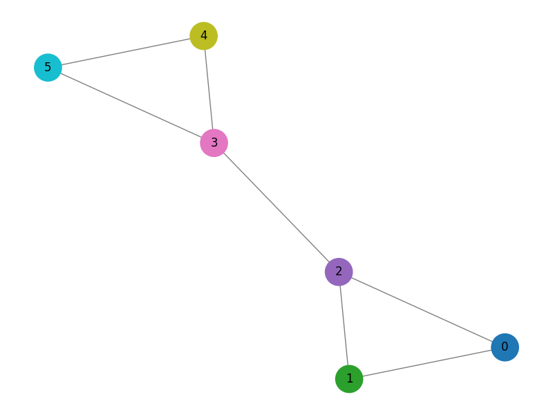

 Rede após o Label Propagation

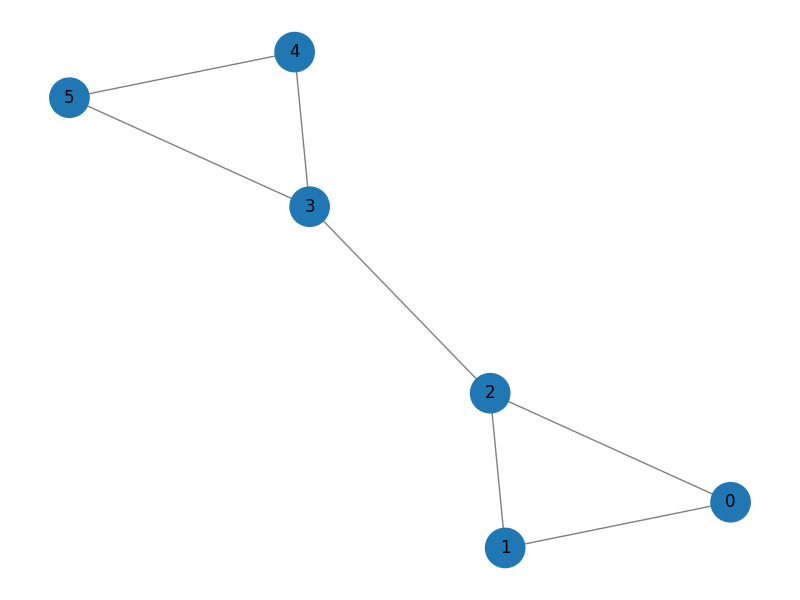

 Convergência do algoritmo

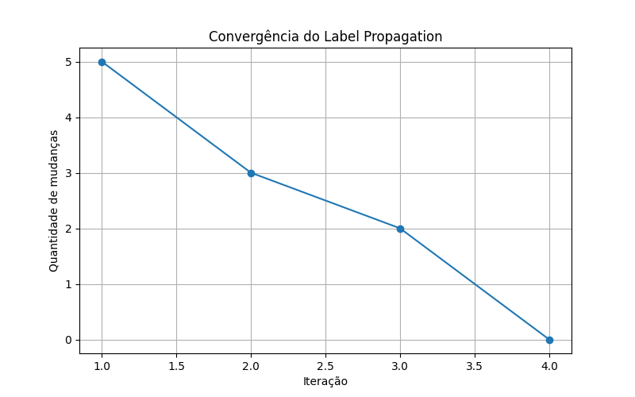

 Tamanho das comunidades

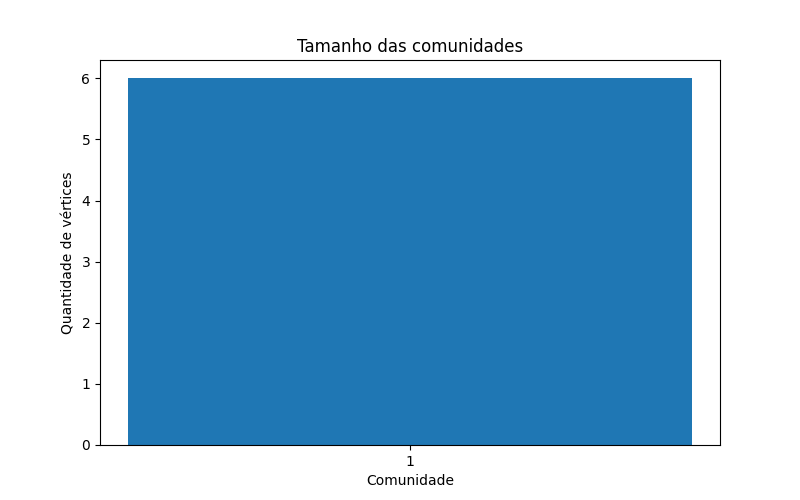


***2 Dataset: rede2.csv***

Rótulos Finais: [2 2 2 2 6 6 6]
Número de comunidades: 2
Número de iterações: 3
Visualizações

Rede inicial

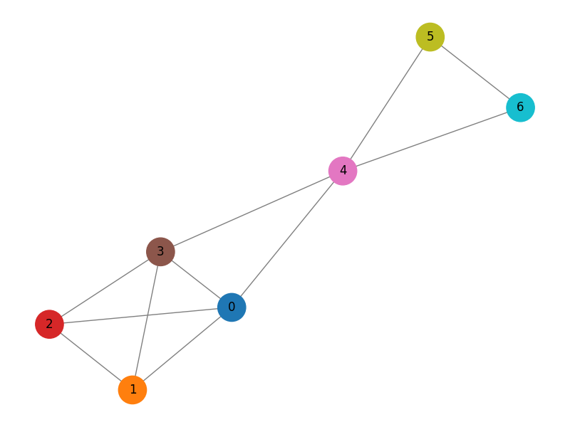

 Rede após o Label Propagation


 Convergência do algoritmo

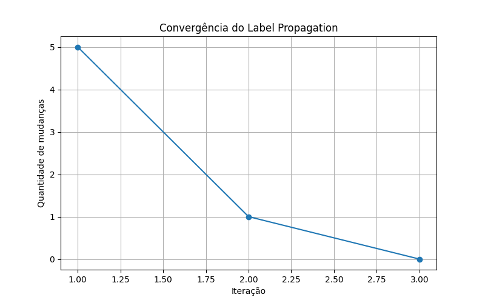

 Tamanho das comunidades

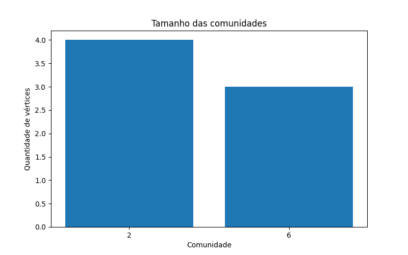


***3 Dataset: zachary.csv***

Rótulos Finais: [ 0  1  1 33  1 17 17 17  1 33 33 17  1  1  1 33 33 17  1 33  1 33  1 33
 33 33 33 33 33 33 33 33 33 33 33]
Número de comunidades: 4
Número de iterações

Visualizações

Rede inicial

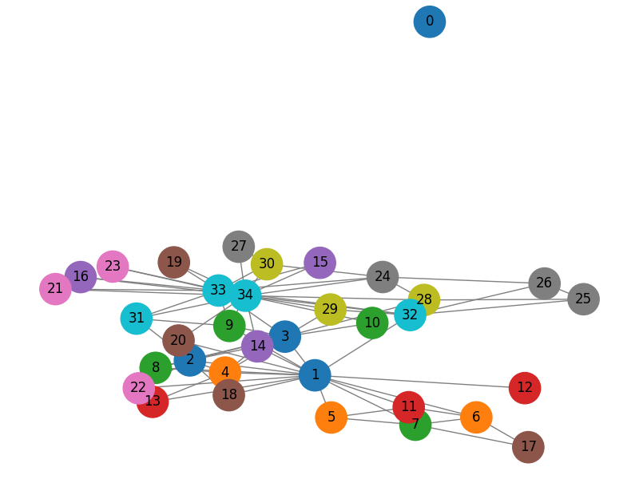

 Rede após o Label Propagation

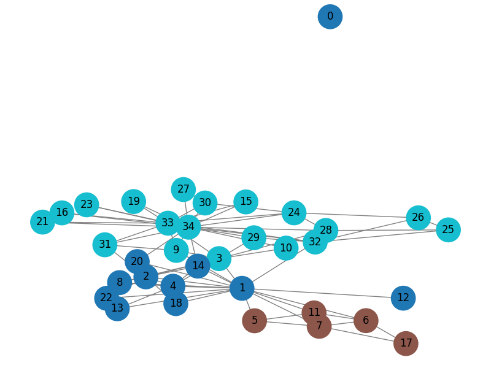

 Convergência do algoritmo

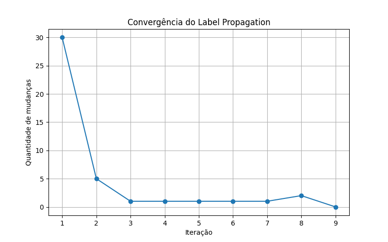

 Tamanho das comunidades

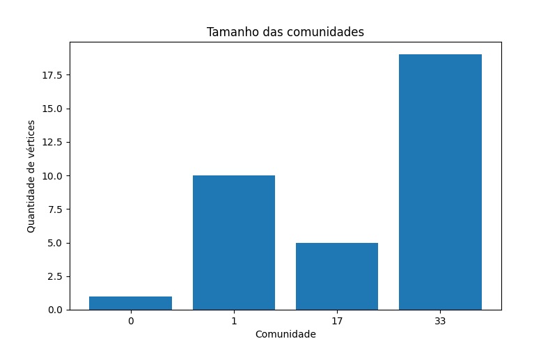


**Principais dificuldades encontradas**

Durante a implementação, as principais dificuldades foram:

- **Representação da rede:** o dataset estava em formato de lista de arestas, sendo necessário convertê-lo para uma matriz de adjacência.
- **Identificação dos vizinhos:** foi necessário corrigir a lógica para obter corretamente os vizinhos de cada vértice.
- **Inicialização e atualização dos rótulos:** cada vértice deve iniciar com um rótulo próprio e receber posteriormente o rótulo predominante entre seus vizinhos.
- **Aleatoriedade:** diferentes execuções podem gerar identificadores de comunidades diferentes devido à ordem aleatória dos vértices e aos empates.
- **Visualização:** foi necessário separar as funções de geração dos gráficos da implementação principal, mantendo o código organizado.


